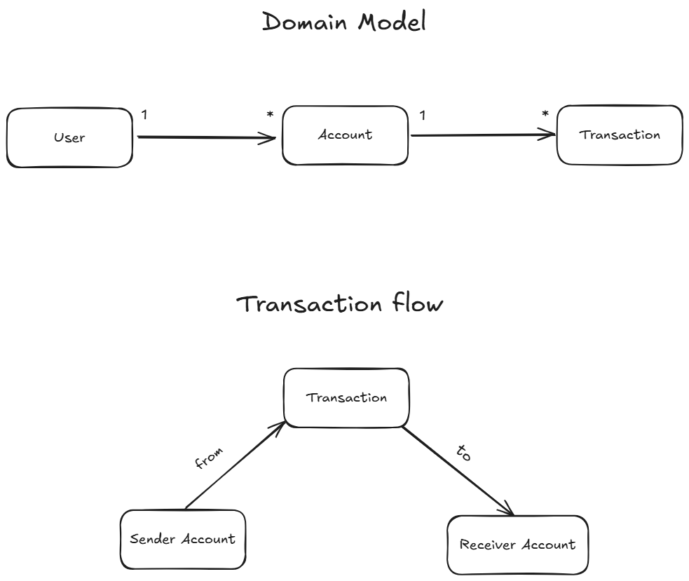

# RFC-001: Banking Challenge – Overview, Domain Model, and Database Design

- **Author:** Douglas
- **Created At:** 2025-07-22
- **Last Updated:** 2025-08-09

## 📄 Context

This document outlines the initial technical proposal for implementing the **Woovi Challenge**, covering the overall vision, domain modeling, and MongoDB database design.

---

## 🎯 Overview

The challenge consists of building a simple bank replica with the ability to:

- Send and receive transactions between accounts
- Calculate the available balance of an account

---

## 🏦 Reference: Brazilian Banking System

The Brazilian banking system is composed of financial institutions regulated and supervised by the Central Bank of Brazil (BACEN). Each bank account has unique attributes such as:

- **Agency**: agency identifier (e.g., 0001)
- **Account Number**: unique number within the agency
- **Verification Digit (DV)**: ensures account number integrity
- **Account Type**: current, savings, payment, etc.
- **CPF/CNPJ**: national identification for individuals or companies

> _Note: Although this project is not integrated with the official Brazilian Payment System, it takes inspiration from its structure and best practices to simulate realistic banking transactions, account behavior, and identity management._

---

## 🧱 Domain Modeling

The diagram below illustrates the main relationships within the domain and transaction flow:



### 🧩 Entities

#### 1. User

| Field            | Type   | Description                            |
| ---------------- | ------ | -------------------------------------- |
| ID               | String | Unique identifier (UUID)               |
| taxId (CPF/CNPJ) | String | National ID document (unique per user) |
| name             | String | Full name of the user                  |
| email            | String | Email address (unique)                 |
| passwordHash     | String | Encrypted password hash                |
| role             | String | User permission (user or admin)        |
| createdAt        | Date   | Creation timestamp                     |
| updatedAt        | Date   | Last update timestamp                  |

#### 2. Account

| Field         | Type    | Description                              |
| ------------- | ------- | ---------------------------------------- |
| ID            | String  | Unique identifier (UUID)                 |
| ownerId       | String  | Reference to the user who owns it        |
| accountNumber | String  | Account number (unique per account)      |
| accountDigit  | String  | Verification digit (DV)                  |
| agency        | String  | Bank agency number                       |
| type          | String  | Account type (current, savings, payment) |
| balance       | Number  | Account balance (in cents)               |
| active        | Boolean | Account status                           |
| createdAt     | Date    | Creation timestamp                       |
| updatedAt     | Date    | Last update timestamp                    |

#### 3. Transaction

| Field         | Type   | Description                                |
| ------------- | ------ | ------------------------------------------ |
| ID            | String | Unique identifier (UUID)                   |
| fromAccountId | String | Source account                             |
| toAccountId   | String | Destination account                        |
| amount        | Number | Transaction amount (in cents)              |
| type          | String | Transaction type (pix, debit, credit)      |
| status        | String | Transaction status (processing, completed) |
| date          | Date   | Date of the operation                      |
| createdAt     | Date   | Creation timestamp                         |
| updatedAt     | Date   | Last update timestamp                      |

---

## 🗃️ Database Modeling (MongoDB)

The project uses a document-based NoSQL database (MongoDB). Collections are designed around key domain entities following the principles of separation of concerns and optimized query access patterns.

### Collections

---

#### user

**Purpose:**

Stores identity and authentication information for system users.

**Main Fields:**

- `_id:`: Unique identifier (ObjectId)
- `taxId`: National identifier (CPF or CNPJ), must be unique
- `name`: Full name of the user
- `email`: Unique email address
- `role`: String (`user` or `admin`)
- `passwordHash`: Hashed password for authentication
- `createdAt`, `updatedAt`: Timestamps

**Sample `user` document:**

```json
{
  "_id": "64be3f2e5b9e3f001f0a1234",
  "taxId": "12345678901",
  "name": "João da Silva",
  "email": "joao.silva@email.com",
  "passwordHash": "$2b$10$Y5dLphtlA2s5pNW6J9P/hO8Z2f1nRbJmKrETbZMnA.1gZLZ3xZqEa",
  "createdAt": "2025-07-22T13:00:00Z",
  "updatedAt": "2025-07-22T13:00:00Z"
}
```

---

#### account

**Purpose:**

Represents bank accounts tied to individual users. An account is uniquely identified by its account number within a given agency.

**Main Fields:**

- `_id`: Unique identifier (ObjectId)
- `ownerId`: References a `user.\_id`
- `accountNumber`: Unique string identifier for the account (may start with zero)
- `accountDigit`: Verification digit
- `agency`: Agency code (string)
- `type`: String (`current`, `savings`, `payment`, etc.)
- `balance`: Current balance (in cents)
- `active`: Account status
- `createdAt`, `updatedAt`: Timestamps

**Sample `account` document:**

```json
{
  "_id": "64be3f2e5b9e3f001f0a5678",
  "ownerId": "64be3f2e5b9e3f001f0a1234",
  "accountNumber": "1234567",
  "accountDigit": "0",
  "agency": "0001",
  "type": "payment",
  "balance": 250000,
  "active": true,
  "createdAt": "2025-07-22T13:00:00Z",
  "updatedAt": "2025-07-22T13:00:00Z"
}
```

---

#### transaction

**Purpose:**

Records all monetary transactions between accounts. Includes debits and credits and supports various transaction types.

**Main Fields:**

- `_id`: Unique transaction identifier (ObjectId)
- `fromAccountId`: Reference to the sender account
- `toAccountId`: Reference to the receiver account
- `amount`: Value of the transaction in cents
- `type`: String (`pix`, `debit` or `credit`)
- `status`: String (`processing`, `completed`)
- `date`: Timestamp of the transaction
- `createdAt`, `updatedAt`: Timestamps

**Sample `transaction` document:**

```json
{
  "_id": "64be3f2e5b9e3f001f0adef0",
  "fromAccountId": "64be3f2e5b9e3f001f0a5678",
  "toAccountId": "64be3f2e5b9e3f001f0a9abc",
  "amount": 5000,
  "type": "debit",
  "status": "processing",
  "createdAt": "2025-07-22T13:00:00Z",
  "updatedAt": "2025-07-22T13:00:00Z"
}
```
